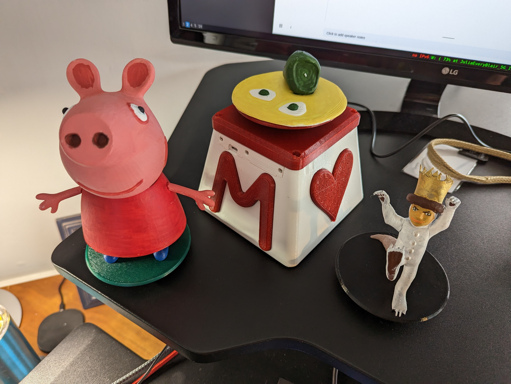

# The Momobox
A build-it-yourself MP3 player for toddlers, and maybe for adults too. 3D-print your own custom figurines (we call them _Momies_) and pair them with your favorite stories, songs, or audiobooks. If you have a 3D printer and the ability to solder, you can build one of these for roughly the same cost as a commercial [Toniebox](https://us.tonies.com/pages/toniebox), and without the long-term cost of ownership. Plus, the momobox and the associated momies are distinctly yours!

The momobox started as a toy I built for my daughter, who we call Momo, during my batch at [the Recurse Center](https://www.recurse.com). It runs on a Raspberry Pi Pico, and incorporates an RFID sensor, speaker, SD card, and a 3D-printed enclosure and momies.

## You Can Build One Too!
Take a look at the [project wiki](https://github.com/blairfrandeen/momobox/wiki) for resources and to get started. At this time the project is not fully documented - if you'd like support, encouragement, or get stuck during the build, please feel free to reach out!

## 3D Printed Components
The design for the 3D printed components lives in [OnShape](https://cad.onshape.com/documents/79b0dabc494fde770de26b57/w/b19bbc68ed3995e5b344c842/e/d2a39d4dcadbb5ff28daf759).

## Materials
Materials currently on order are stored in this [Google Sheet](https://docs.google.com/spreadsheets/d/11zDQTo5MPM0dLdLS7p9JRmXvDPAh0dKTZ6d4dLGUlPc/edit?usp=sharing). A finalized bill of materials should go in this section once an initial build configuration has been selected.

## Resources
List of learning & technical resources that can be used to complete this project:
- [Raspberry Pi Documentation](https://www.raspberrypi.com/documentation/computers/getting-started.html)
- [Uploading to Raspberry Pi Pico without Thonny](https://mikeesto.medium.com/uploading-to-the-raspberry-pi-pico-without-thonny-53de1a10da30)
- [Adafruit](https://learn.adafruit.com/) - Some beginning elex tutorials and components
- [Simple MP3 Audio Playback With Raspberry Pi Pico](https://embeddedcomputing.com/technology/processing/interface-io/simple-mp3-audio-playback-with-raspberry-pi-pico) - Good tutorial to start working next.
- [Raspberry Pi Pico Tutorial with battery hookup](https://www.raspberrypi.com/tutorials/raspberry-pi-pico-iron-man-arc-reactor/)
- [Tom's Hardware Pico Page](https://www.tomshardware.com/news/raspberry-pi-pico-tutorials-pinout-everything-you-need-to-know)
- [Raspberry Pi Projects Page](https://projects.raspberrypi.org/en/projects/getting-started-with-the-pico) - Getting started with Pico tutorial

