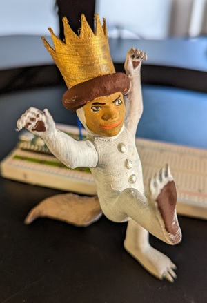

# The Momo Box
An open-source clone of the [Toniebox](https://us.tonies.com/pages/toniebox). This is a toy I'm building for my daughter (Momo). It consists of an MP3 player, a speaker, an RFID sensor, and 3D printed figurines. Each figurine (called a Momie) has a unique song or story associated with it. When the Momies are placed on top of the box, the song or story will play.

For example, when this wild gentleman is placed on top of the box, Momo will be serenaded with [Where the Wild Things Are](https://www.youtube.com/watch?v=PYODJWX3M0k):

We plan to make multiple Momies, and have our family members record themselves reading stories and singing songs for Momo to listen to.

**Contributors are Welcome!** I know almost nothing about electronics or embedded software, so this is very much a learning activity! Happy to have anyone jump in and help on any part of this.

## Project Description
This is an open-source hardware, software, and electronics project that I'm undertaking as part of my batch in Recurse Center. The near-term goal is to develop a **Minimum Viable Product**, which has the following characteristics:

- [ ] Able to play one song when a Momie with an embedded RFID chip is brought nearby. _(Ok if this song is manually loaded into the electronics without a nice front-end)_
- [ ] Powered by a battery.
- [ ] Volume is adjustable to an appropriate level. _(Ok if this is done via software or hard-to-reach hardware)_
- [ ] Momie is secured to the top of the enclosure with a magnet.
- [ ] Stops playing when the Momie is removed.
- [ ] Includes mechanical switch to switch between power-off and standby modes.
- [ ] Housed in a mechanical enclosure that is more-or-less toddler-proof.

## Resources
List of learning & technical resources that can be used to complete this project:
- [Raspberry Pi Documentation](https://www.raspberrypi.com/documentation/computers/getting-started.html)
- [Uploading to Raspberry Pi Pico without Thonny](https://mikeesto.medium.com/uploading-to-the-raspberry-pi-pico-without-thonny-53de1a10da30)
- [Adafruit](https://learn.adafruit.com/) - Some beginning elex tutorials and components
- [Simple MP3 Audio Playback With Raspberry Pi Pico](https://embeddedcomputing.com/technology/processing/interface-io/simple-mp3-audio-playback-with-raspberry-pi-pico) - Good tutorial to start working next.
- [Raspberry Pi Pico Tutorial with battery hookup](https://www.raspberrypi.com/tutorials/raspberry-pi-pico-iron-man-arc-reactor/)
- [Tom's Hardware Pico Page](https://www.tomshardware.com/news/raspberry-pi-pico-tutorials-pinout-everything-you-need-to-know)
- [Raspberry Pi Projects Page](https://projects.raspberrypi.org/en/projects/getting-started-with-the-pico) - Getting started with Pico tutorial

## Subsystems
### Electrical
Electical / Off the shelf components:
- Raspberry Pi Pico
- Battery - Last for ~1 week of usage (3 hrs total playtime + standby time)
- Speaker - needs to be audiable above screaming baby?
- SD Card or Onboard Memory - Enough to hold ~6 hours of audio (min)
- RFID sensor
- RFID chips
- Magnets
- Hall Sensor

### Mechanical
All non off-the-shelf components will be 3D printed. STL / CAD files will be part of the repository. There will be various components for the base / housing, as well as individual Momies. There should be a univervsal base for the Momies that includes a place to glue-in an RFID chip.

#### 3D Printed Components
Component | CAD Source | STL File
--- | --- | --- 
Base | [OnShape](https://cad.onshape.com/documents/79b0dabc494fde770de26b57/w/b19bbc68ed3995e5b344c842/e/d2a39d4dcadbb5ff28daf759) | [momobox_base.stl](https://github.com/blairfrandeen/momobox/blob/master/packaging/momobox_base.stl)
Lid | work to go | work to go
Momie Stand | work to go | work to go

### Software
#### Onboard software (software that starts / stop songs, etc.)
**Target user:** 2 year-old
The behavior should be as follows:
- When recognized Momie is placed on the box, play the associated song
- When the Momie is removed, pause the song
- If the same Momie is replaced within a certain time interval, resume play
- If the Momie is replaced after a sufficiently long time, start over

#### Admin Software (add songs, add / remove figures, etc.)
**Target user:**  adult who is comfortable using a linux terminal

## Materials
Materials currently on order are stored in this [Google Sheet](https://docs.google.com/spreadsheets/d/11zDQTo5MPM0dLdLS7p9JRmXvDPAh0dKTZ6d4dLGUlPc/edit?usp=sharing). A finalized bill of materials should go in this section once an initial build configuration has been selected.
