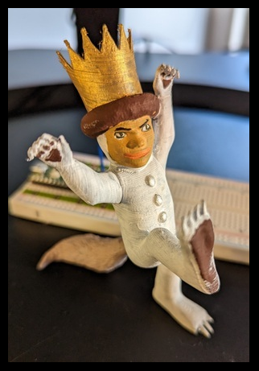

# The Momo Box
An open-source clone of the [Toniebox](https://us.tonies.com/pages/toniebox). This is a toy I'm building for my daughter (Momo). It consists of an MP3 player, a speaker, an RFID sensor, and 3D printed figurines. Each figurine has a unique song or story associated with it. When the figurines are placed on top of the box, the song or story will play.

For example, when this wild gentleman is placed on top of the box, Momo will be serenaded with [Where the Wild Things Are](https://www.youtube.com/watch?v=PYODJWX3M0k):

## Project Description
This is an open-source hardware, software, and electronics project that I'm undertaking as part of my batch in Recurse Center.

## Resources

## Subsystems

### Electrical

### Mechanical

### Software
- Onboard software (software that starts / stop songs, etc.)
    - Target user: 2 year-old
- Admin Software (add songs, add / remove figures, etc.)
    - Target user: adult who at this point can use a terminal

## Materials
- Electical / Off the shelf components
    - Raspberry Pi Pico
    - Battery - Last for ~1 week of usage (3 hrs total playtime + standby time)
    - Speaker - needs to be audiable above screaming baby?
    - SD Card or Onboard Memory - Enough to hold ~6 hours of audio (min)
    - RFID sensor
    - RFID chips
    - Magnets
    - Hall Sensor
- 3D Printed components
    - Base
    - Figurines

